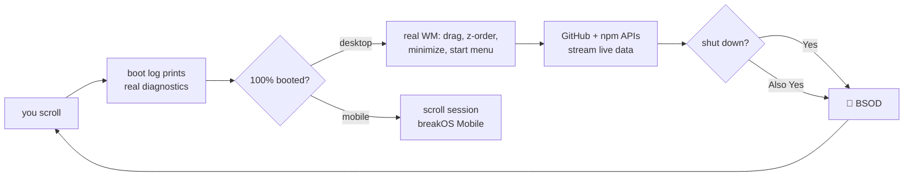

<div align="center">

```
 ██████╗ ██████╗ ███████╗ █████╗ ██╗  ██╗ ██████╗ ███████╗
 ██╔══██╗██╔══██╗██╔════╝██╔══██╗██║ ██╔╝██╔═══██╗██╔════╝
 ██████╔╝██████╔╝█████╗  ███████║█████╔╝ ██║   ██║███████╗
 ██╔══██╗██╔══██╗██╔══╝  ██╔══██║██╔═██╗ ██║   ██║╚════██║
 ██████╔╝██║  ██║███████╗██║  ██║██║  ██╗╚██████╔╝███████║
 ╚═════╝ ╚═╝  ╚═╝╚══════╝╚═╝  ╚═╝╚═╝  ╚═╝ ╚═════╝ ╚══════╝
```

### `v3.0 — it builds. it breaks. it drags.`

*my portfolio, disguised as an operating system. you boot it by scrolling. then it becomes a real desktop.*


-1d2438?style=flat-square)


</div>

---

> [!WARNING]
> This portfolio contains a fully working `rm -rf /`. It does exactly what
> you'd hope. The blue screen is included free of charge. New in v3: you can
> also drag project files into the trash. The OS will not let you.

## 🖥️ What is this

A developer portfolio that takes the phrase *"personal site"* literally:
it's an entire (fictional) operating system. You **scroll to boot it** —
the boot log prints *true diagnostics* about your actual page load — and
when boot hits 100%, the page stops being a page. It becomes a **desktop**:
windows drag, stack, minimize to a real taskbar, and launch from icons or
a start menu. The icons drag too — single click selects, double-click
launches, and an empty patch of desk gives you a marquee. Where you leave
things is where they stay. On phones you get **breakOS Mobile**, the scroll edition,
because the mobile version of any OS is always slightly worse. That is
canon.

```console
guest@breakos:~$ whoami
guest. but the OS is nick trimandylis — swift, python, typescript, glsl.
```

## 🪟 The apps

| | app | what it actually does |
|---|---|---|
| ⏻ | **boot log** | scroll-scrubbed; every line is a real measurement of *your* browser. that's the joke — it's all true |
| ▤ | **`~/things-i-made`** | file manager of the curated six: `petal_ai.swift`, `tokenpilot.ts`, `apex.ts`, `llm_mafia.py`, `agent_wrapped.ts`, `ib_news_site.py` — click to open, drag to trash to be told no |
| ▦ | **breakpkg** | package manager for the CLI family — swatch, juke, jazz, bacpack, dt, cine, agent-wrapped. every row a real repo; agent-wrapped's npm version fetched **live** from the registry |
| ◔ | **System Monitor** | my repos, fetched **live** from the GitHub API as processes — real sizes as memory, real push times as uptime, plus *your* actual FPS |
| ▮ | **terminal** | a working shell. `help`, `pkg list`, `defrag`, `sudo hire-nick`, `vim` (good luck quitting). `man juke` fetches the CLI's **actual man page** from its repo and renders it |
| ❒ | **the .docx icons** | the IB coursework — EE and four IAs — sitting on the desk like any real desktop. they open; they do not download. sealed until results day |
| ◍ | **About This Computer** | processor: `1 × human, runs warm under deadline`. peripherals: `7 command-line tools attached. one escaped to npm` |
| ⏻ | **start menu → Shut down?** | `[Yes]` `[Also Yes]` → BSOD → `stop code: VISITOR_ATTEMPTED_TO_LEAVE` → reboots you to the boot log |

## 🚀 Run it

```bash
git clone https://github.com/nitrimandylis/portfolio.git
cd portfolio
python3 -m http.server     # → http://localhost:8000
```

No `npm install`. No build. No `node_modules` folder heavier than the
concept of regret. Three CDN script tags and a dream.

## 🧠 How it works



| layer | file | job |
|---|---|---|
| 🎨 design system | `css/breakos.css` | cream CRT paper, ink navy, coral, teal. bevels. scanlines |
| 🌊 live wallpaper | `js/wallpaper.js` | canvas halftone dots reacting to scroll — now with `defrag` support |
| ⏻ boot | `js/boot.js` | honest boot log (`performance` + `navigator`, zero fiction), hands off to the desktop |
| 🪟 window manager | `js/os.js` | drag, z-order, minimize/maximize, taskbar switcher, start menu, trash, BSOD, easter eggs |
| ▦ packages | `js/breakpkg.js` | the CLI registry — GitHub push dates + live npm version, one shared fetch |
| 📊 monitor | `js/monitor.js` | GitHub repos as processes + real FPS/uptime |
| ▮ shell | `js/terminal.js` | the command parser. yes, `rm -rf /` is wired up |

**Type stack:** [VT323](https://fonts.google.com/specimen/VT323) for OS chrome ·
[Atkinson Hyperlegible](https://fonts.google.com/specimen/Atkinson+Hyperlegible)
for body (an accessibility font in an OS parody — the quietest joke here) ·
IBM Plex Mono for data.

## 🥚 Easter eggs

<details>
<summary><b>spoilers — earn them honestly or click here</b></summary>

- open the browser console → the kernel has opinions about you
- type <kbd>s</kbd><kbd>e</kbd><kbd>a</kbd><kbd>l</kbd> anywhere → `mascot.service` deploys
- type <kbd>f</kbd><kbd>1</kbd> anywhere → five red lights. you know what happens when they go out
- drag a project file into the trash → the OS declines, and counts your attempts
- terminal: `defrag` → the wallpaper tidies itself up, then admits nothing moved
- terminal: `sudo hire-nick` → generates an offer letter addressed to me
- terminal: `rm -rf /` → finds out
- terminal: `vim` → you know what happens
- switch tabs → the title sulks: *"breakOS — suspended (it'll keep)"*
- the shutdown dialog counts your boots — using *your own* localStorage. I track nobody; you surveil yourself

</details>

## 🗿 Archaeology

`v1/` holds the previous design — dark "organic brutalism" with a GLSL
simplex-noise shader. v2 was the scroll-only OS. v3 made the windows real.
We honor our ancestors; we do not load them.

---

<div align="center">

**[Nick Trimandylis](https://github.com/nitrimandylis)** · [nicktrim8@duck.com](mailto:nicktrim8@duck.com)

*yes, the email is a duck* 🦆

MIT licensed — take anything. it's a portfolio, that's the point.

</div>
