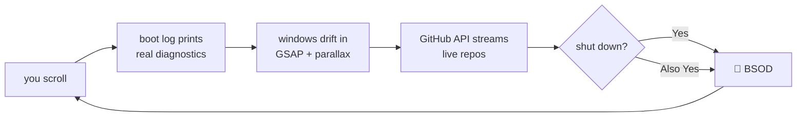

<div align="center">

```
 ██████╗ ██████╗ ███████╗ █████╗ ██╗  ██╗ ██████╗ ███████╗
 ██╔══██╗██╔══██╗██╔════╝██╔══██╗██║ ██╔╝██╔═══██╗██╔════╝
 ██████╔╝██████╔╝█████╗  ███████║█████╔╝ ██║   ██║███████╗
 ██╔══██╗██╔══██╗██╔══╝  ██╔══██║██╔═██╗ ██║   ██║╚════██║
 ██████╔╝██║  ██║███████╗██║  ██║██║  ██╗╚██████╔╝███████║
 ╚═════╝ ╚═╝  ╚═╝╚══════╝╚═╝  ╚═╝╚═╝  ╚═╝ ╚═════╝ ╚══════╝
```

### `v2.6.11 — it builds. it breaks. it reboots.`

*my portfolio, disguised as an operating system you boot by scrolling*


-1d2438?style=flat-square)


</div>

---

> [!WARNING]
> This portfolio contains a fully working `rm -rf /`. It does exactly what
> you'd hope. The blue screen is included free of charge.

## 🖥️ What is this

A developer portfolio that takes the phrase *"personal site"* literally:
it's an entire (fictional) operating system. You **scroll to boot it**.
The boot log prints *true diagnostics* about your actual page load.
Windows drift in with parallax, and their `✕` buttons genuinely close them
— don't worry, they go to the taskbar, not therapy.

```console
guest@breakos:~$ whoami
guest. but the OS is nick trimandylis — swift, python, typescript, glsl.
```

## 🪟 The windows

| | window | what it actually does |
|---|---|---|
| ⏻ | **boot log** | scroll-scrubbed; every line is a real measurement of *your* browser. that's the joke — it's all true |
| ▤ | **`~/things-i-made`** | file manager of curated projects. `petal_ai.app`, `llm_mafia.py`, `jarvis.ts`, `kizuna.app`, `cosmos.glsl` — click to open |
| ◔ | **System Monitor** | my repos, fetched **live** from the GitHub API as processes — real sizes as memory, real push times as uptime, plus *your* actual FPS and scroll depth |
| ▮ | **terminal** | a working shell. `help`, `cat about.txt`, `sudo hire-nick` (prints an offer letter), `vim` (good luck quitting) |
| ◍ | **About This Computer** | processor: `1 × human, runs warm under deadline`. known issues: `starts side projects at 1am. will not patch` |
| ⏻ | **Shut down?** | `[Yes]` `[Also Yes]` → BSOD → `stop code: VISITOR_ATTEMPTED_TO_LEAVE` → reboots you to the top |

## 🚀 Run it

```bash
git clone https://github.com/nitrimandylis/portfolio.git
cd portfolio
python3 -m http.server     # → http://localhost:8000
```

No `npm install`. No build. No `node_modules` folder heavier than the
concept of regret. Three CDN script tags and a dream.

## 🧠 How it works



| layer | file | job |
|---|---|---|
| 🎨 design system | `css/breakos.css` | cream CRT paper, ink navy, coral, teal. bevels. scanlines |
| 🌊 live wallpaper | `js/wallpaper.js` | canvas halftone dots that react to scroll velocity |
| ⏻ boot | `js/boot.js` | honest boot log (`performance` + `navigator`, zero fiction) |
| 🪟 window manager | `js/os.js` | drift-in, close/maximize, taskbar tray, BSOD, easter eggs |
| 📊 monitor | `js/monitor.js` | GitHub repos as processes + real FPS/scroll/uptime |
| ▮ shell | `js/terminal.js` | the command parser. yes, `rm -rf /` is wired up |

**Type stack:** [VT323](https://fonts.google.com/specimen/VT323) for OS chrome ·
[Atkinson Hyperlegible](https://fonts.google.com/specimen/Atkinson+Hyperlegible)
for body (an accessibility font in an OS parody — the quietest joke here) ·
IBM Plex Mono for data.

## 🥚 Easter eggs

<details>
<summary><b>spoilers — earn them honestly or click here</b></summary>

- open the browser console → the kernel has opinions about you
- type <kbd>s</kbd><kbd>e</kbd><kbd>a</kbd><kbd>l</kbd> anywhere → `mascot.service` deploys
- terminal: `sudo hire-nick` → generates an offer letter addressed to me
- terminal: `rm -rf /` → finds out
- terminal: `vim` → you know what happens
- switch tabs → the title sulks: *"breakOS — suspended (it'll keep)"*
- scroll too fast → the OS files a complaint
- the shutdown dialog counts your boots — using *your own* localStorage. I track nobody; you surveil yourself

</details>

## 🗿 Archaeology

`v1/` holds the previous design — dark "organic brutalism" with a GLSL
simplex-noise shader. The current wallpaper is that shader's cream-colored
grandchild. We honor our ancestors; we do not load them.

---

<div align="center">

**[Nick Trimandylis](https://github.com/nitrimandylis)** · [nicktrim8@duck.com](mailto:nicktrim8@duck.com)

*yes, the email is a duck* 🦆

MIT licensed — take anything. it's a portfolio, that's the point.

</div>
